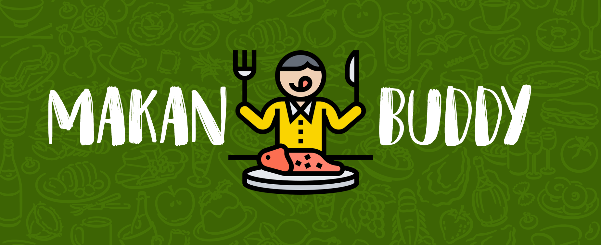

## SECTION 1 : PROJECT TITLE
## Makan Buddy - Intelligent Restaurant Discovery and Reservation System

---

## SECTION 2 : EXECUTIVE SUMMARY / PAPER ABSTRACT
Singapore is widely regarded as a food capital due to the wide variety of cuisines available because of our multi ethnic composition. The food and beverage industry in Singapore was worth $8.3 billion dollars in 2019 and is expected to grow 2.1% over the next five years.  This growth is aligned to the exponential global food and beverages (F&B) growth, alongside the growth in urban populations worldwide. Individuals are becoming more discerning, driving demand more nutritious, healthy food.

Competition is stiff in the F&B industry, with over 6,500 establishments. An increase in the number of competitors in the market offering similar and new products that are competitively priced could have also posed a challenge for many F&B operators here, and many new F&B joints struggle to differentiate themselves and establish a following. Some of the challenges which F&B might face is high rental and food cost, but most critically the lack of manpower.

One perpetual problem faced by diners is having to make dining choices and the numerous steps involved in ensuring an enjoyable dining experience. This process encompasses the search for restaurants, reading available reviews and opinions of restaurants and checking availability of the restaurant for reservations. On the other hand, establishments seek to minimize their marketing costs and build a customer base. Makan Buddy seeks to address both problems from a consumer and business perspective. By leveraging on process automation and machine learning, we want to be able to connect diners to new restaurants and make the process of restaurant reservation a more seamless and enjoyable experience. 

---

## SECTION 3 : CREDITS / PROJECT CONTRIBUTION

| Official Full Name  | Student ID  | Work Items | 
| :------------ |:---------------:| :-----| 
| Tan Wei Lian | A0048135J | Restaurant Search Agent, Restaurant Similarity Model|
| Tang Meng | A0137099U | Slack Chat Bot, Video, User Guide|
| Leong, Darryl | A0195318X | Web Scraping, TAGUI Development, Project Report| 

---

## SECTION 4 : VIDEO OF SYSTEM MODELLING & USE CASE DEMO

`You can view the video: ` https://www.youtube.com/watch?v=ZxQABx7iIR4&feature=youtu.be

---

## SECTION 5 : USER GUIDE

`Refer to Annex A - User Guide in project report at Github Folder: ProjectReport`

---
## SECTION 6 : PROJECT REPORT / PAPER

`<Github File Link>` : <https://github.com/wliant/ISA-IPA-2020-05-03-IS01PT-GRP7-Makan-Buddy/blob/master/ProjectReport/ProjectReport.pdf>

---
## SECTION 7 : MISCELLANEOUS

N.A.

---
